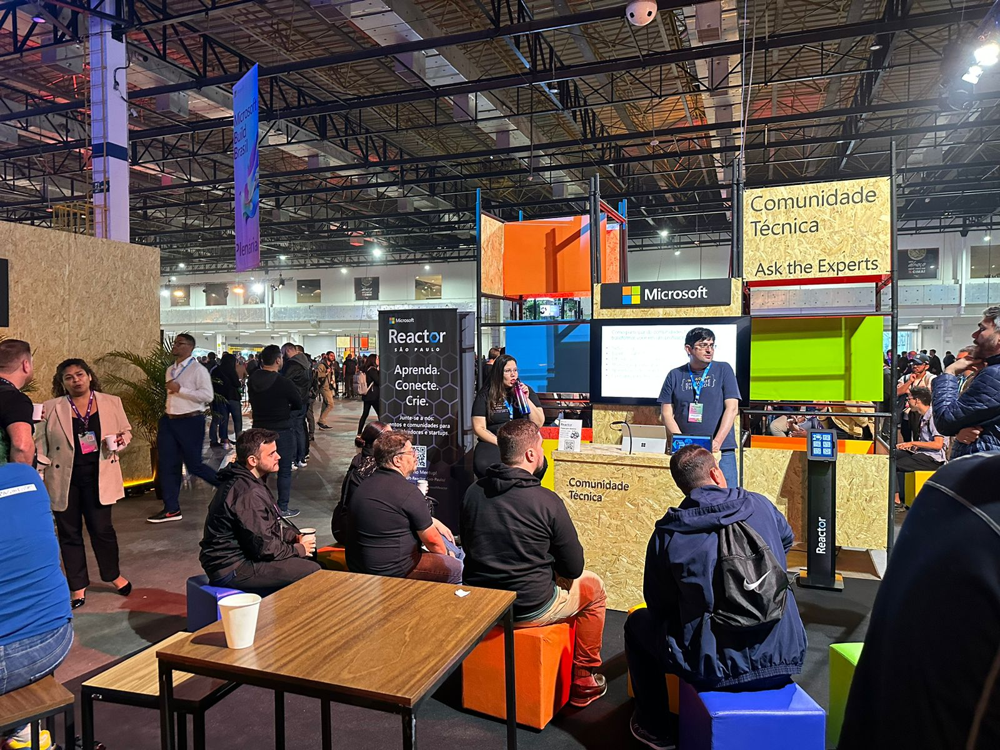
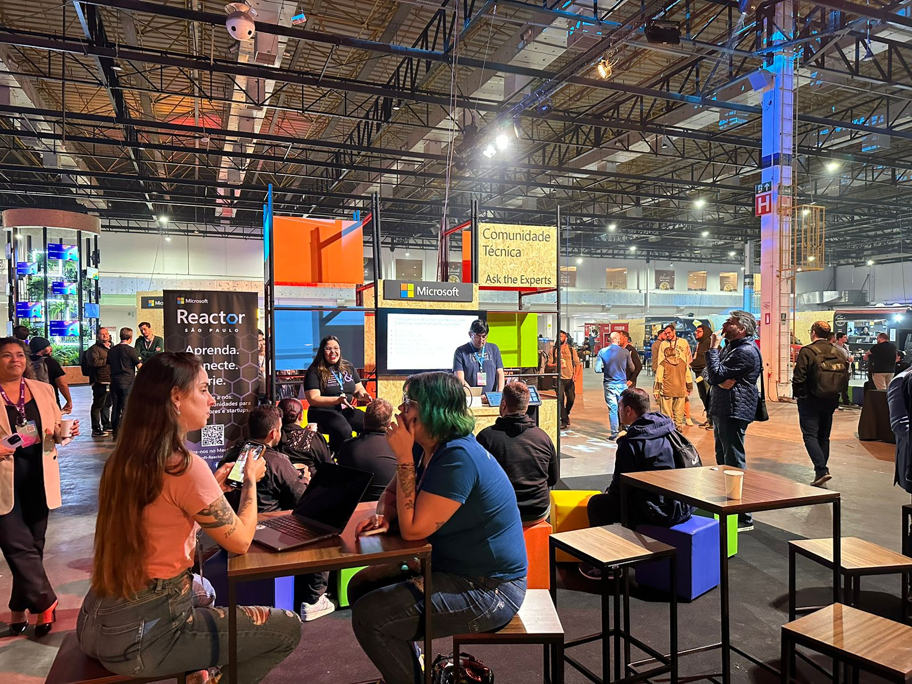
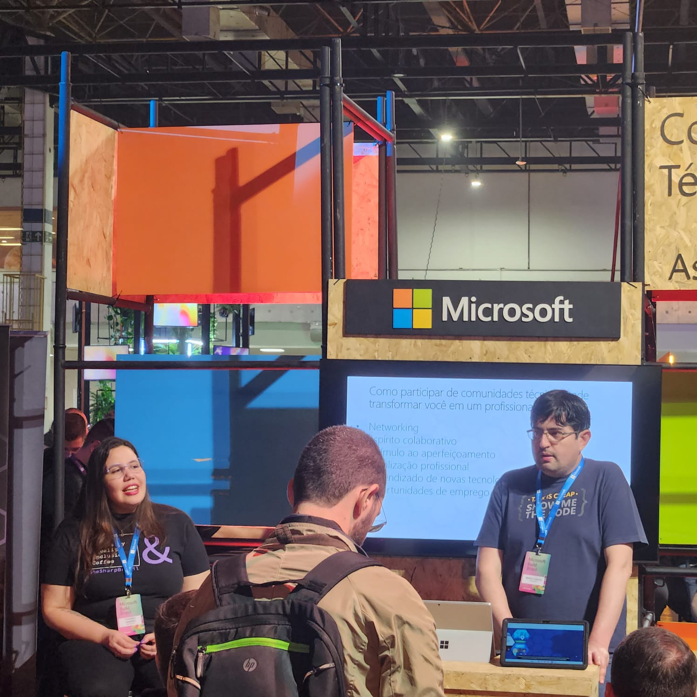
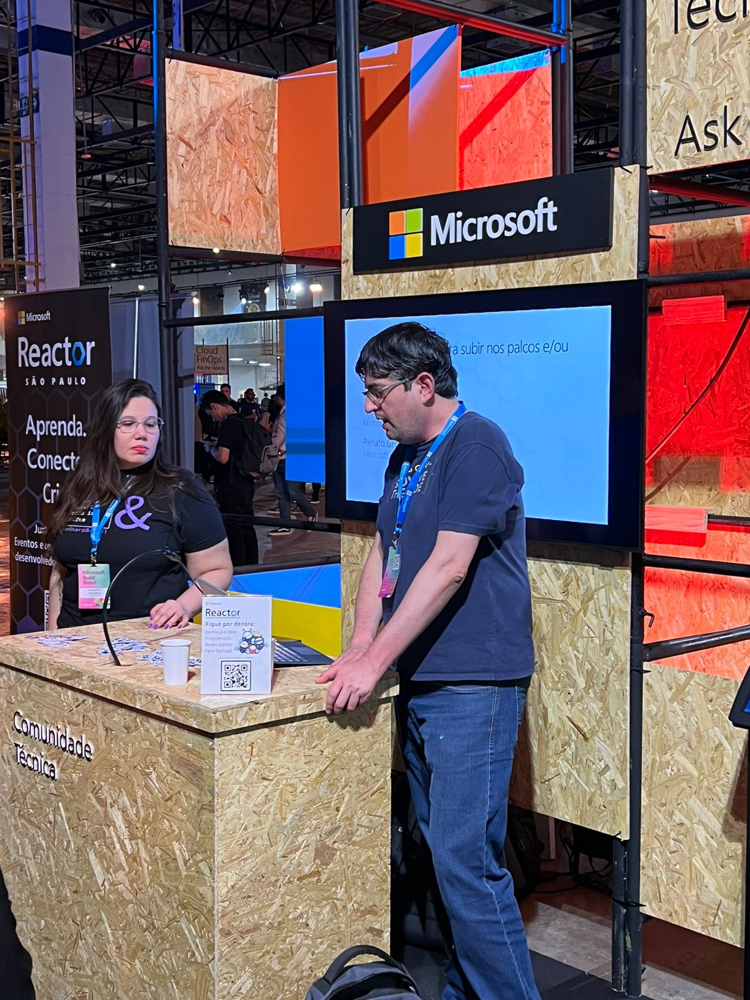
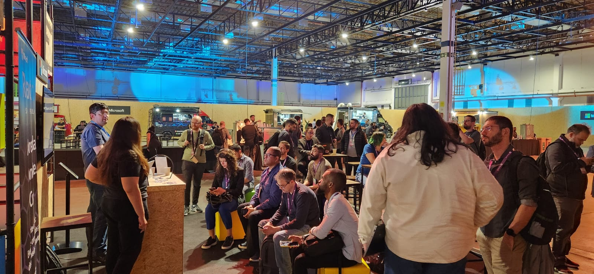
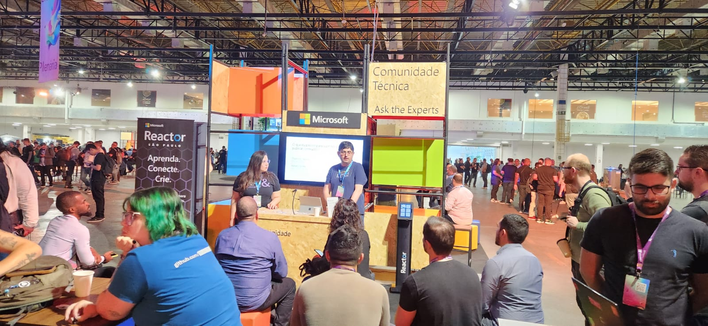

# Microsoft Build Brasil 2023 - São Paulo-SP
Apresentações realizadas durante o **Microsoft Build Brasil 2023** em **São Paulo-SP**. Este evento aconteceu no dia **22/06/2023**.

Informações sobre o evento em postagens no **Instagram**:

- [**Espaço Comunidade Técnica - Ask the Experts - 22/06**](https://www.instagram.com/p/Cty0rZDgdWF/)
- [**Espaço Comunidade Técnica - Ask the Experts - 21/06**](https://www.instagram.com/p/CtxG6rFAh2E/)
- [**Informações gerais e auditório principal - 21/06**](https://www.instagram.com/p/CtwXy0rAqr7/)

Link do evento: [**Microsoft Build Brasil - Microsoft Events**](https://msevents.microsoft.com/event?id=2695088650&amp;wt.mc_id=AID3058360_QSG_SCL_643461)

Foram 2 apresentações no **Espaço Comunidade Técnica - Ask the Experts**:
- **Como participar de comunidades técnicas pode transformar você em um profissional melhor?**
- **O que eu preciso para subir nos palcos e/ou publicar conteúdos?**

Essas 2 apresentações realizei em conjunto com minha amiga **Thamirys Gameiro (Microsoft)**, contando com pessoas de várias localidades nos acompanhando. Nossa participação foi possível graças ao convite e apoio do **Fabio Hara (Microsoft)**, do **Victor Temple (Microsoft Reactor)** e da **Larissa Cyganski (Microsoft Reactor)**. Aproveito para agradecer a todos eles pela oportunidade e toda colaboração.

Como não poderia deixar de ser, nossas talks acabaram envolvendo assuntos como **.NET, C#, ASP.NET Core, Certificações do Azure, Cloud Computing** e **Open Source** (além da temática principal que focou em comunidades técnicas).

Deixo ainda meu muito obrigado aos amigos **Thiago Bertuzzi**, **Ewerton Rodrigues Jordão** e **Diego Moreira Matos** pelas fotos.

A seguir estão algumas fotos e  detalhes dessas apresentações.

---

## Como participar de comunidades técnicas pode transformar você em um profissional melhor?

Horário: **10:40 às 11:00**

Público: **15 pessoas**

---

## O que eu preciso para subir nos palcos e/ou publicar conteúdos?

Horário: **14:40 às 15:00**

Público: **20 pessoas**

